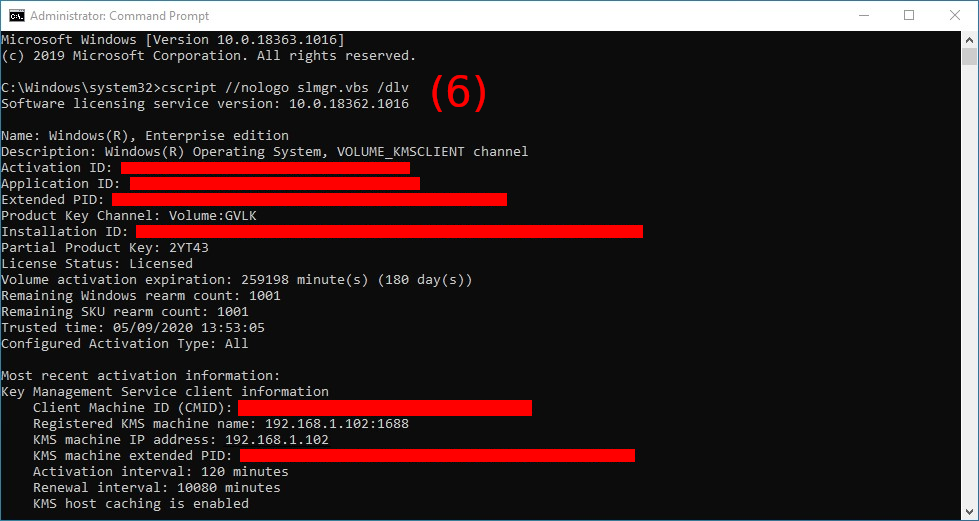

# Usage

## Start Parameters
***

### pykms_Server.py
Follows a list of usable parameters:

    ip <IPADDRESS>
> Instructs py-kms to listen on _IPADDRESS_ (can be an hostname too). If this option is not specified, _IPADDRESS_ 0.0.0.0 is used.

    port <PORT>
> Define TCP _PORT_ the KMS service is listening on. Default is 1688.

    -e or --epid <EPID>
> Enhanced Privacy ID (_EPID_) is a cryptographic scheme for providing anonymous signatures.
Use _EPID_ as Windows _EPID_. If no _EPID_ is specified, a random one will be generated.

    -l or --lcid <LCID>
> Specify the _LCID_ part of the _EPID_. If an _EPID_ is manually specified, this setting is ignored. Default is 1033 (English - US).
The Language Code Identifier (_LCID_) describes localizable information in Windows.
This structure is used to identify specific languages for the purpose of customizing 
software for particular languages and cultures. For example, it can specify the way dates, 
times, and numbers are formatted as strings. It can also specify paper sizes and preferred sort order based on language elements.
The _LCID_ must be specified as a decimal number (example: 1049 for "Russian - Russia"). 
By default py-kms generates a valid locale ID but this may lead to a value which is unlikely to occur in your country. 
You may want to select the locale ID of your country instead. 
See [here](https://msdn.microsoft.com/en-us/library/cc233982.aspx) for a list of valid _LCIDs_.

    -w or --hwid <HWID>
> Use specified _HWID_ for all products. Use `-w RANDOM` to generate a random HWID. Default is _364F463A8863D35F_.
Hardware Identification is a security measure used by Microsoft upon the activation of 
the Windows operating system. As part of the Product Activation system, a unique
HWID number is generated when the operating system is first installed. The _HWID_ identifies the hardware components that the system 
is utilizing, and this number is communicated to Microsoft.
Every 10 days and at every reboot the operating system will generate another _HWID_ number and compare it to the original 
to make sure that the operating system is still running on the same device.
If the two _HWID_ numbers differ too much then the operating system will shut down until Microsoft reactivates the product.
The theory behind _HWID_ is to ensure that the operating system is not being used on any device other than the one
for which it was purchased and registered.
HWID must be an 16-character string of hex characters that are interpreted as a series of 8 bytes (big endian).

    -c or --client-count <CLIENTCOUNT>
> Use this flag to specify the current _CLIENTCOUNT_. Default is None. Remember that a number >=25 is 
required to enable activation of client OSes while for server OSes and Office >=5.

    -a or --activation-interval <ACTIVATIONINTERVAL>
> Instructs clients to retry activation every _ACTIVATIONINTERVAL_ minutes if it was unsuccessful,
e.g. because it could not reach the server. The default is 120 minutes (2 hours). 

    -r or --renewal-interval <RENEWALINTERVAL>
> Instructs clients to renew activation every _RENEWALINTERVAL_ minutes. The default is 10080 minutes (7 days).

    -s or --sqlite [<SQLFILE>]
> Use this option to store request information from unique clients in an SQLite database. Deactivated by default.
If enabled the default database file is _pykms_database.db_. You can also provide a specific location.

    -t0 or --timeout-idle <TIMEOUTIDLE>
> Maximum inactivity time (in seconds) after which the connection with the client is closed. 
Default setting is serve forever (no timeout).

    -t1 or --timeout-sndrcv <TIMEOUTSNDRCV>
> Set the maximum time (in seconds) to wait for sending / receiving a request / response. Default is no timeout.

    -y or --async-msg
> With high levels of logging (e.g hundreds of log statements), in a traditional synchronous log model, 
the overhead involved becomes more expensive, so using this option you enable printing (pretty / logging) messages 
asynchronously reducing time-consuming. Deactivated by default.

    -V or --loglevel <{CRITICAL, ERROR, WARNING, INFO, DEBUG, MININFO}>
> Use this flag to set a logging loglevel. The default is _ERROR_.
example:
```
user@host ~/path/to/folder/py-kms $ python3 pykms_Server.py -V INFO
```
creates _pykms_logserver.log_ with these initial messages:
```
Mon, 12 Jun 2017 22:09:00 INFO     TCP server listening at 0.0.0.0 on port 1688.
Mon, 12 Jun 2017 22:09:00 INFO     HWID: 364F463A8863D35F
```

    -F or --logfile <LOGFILE>
> Creates a _LOGFILE.log_ logging file. The default is named _pykms_logserver.log_.
example:
```
user@host ~/path/to/folder/py-kms $ python3 pykms_Server.py 192.168.1.102 8080 -F ~/path/to/folder/py-kms/newlogfile.log -V INFO -w RANDOM
```
creates _newlogfile.log_ with these initial messages:
```
Mon, 12 Jun 2017 22:09:00 INFO     TCP server listening at 192.168.1.102 on port 8080.
Mon, 12 Jun 2017 22:09:00 INFO     HWID: 58C4F4E53AE14224
```

You can also enable other suboptions of `-F` doing what is reported in the following table:

| command | pretty msg | logging msg | logfile |
| --- | --- | --- | --- |
| `-F <logfile>` | ON | OFF | ON |
| `-F STDOUT` | OFF | ON | OFF |
| `-F FILESTDOUT <logfile>` | OFF | ON | ON |
| `-F STDOUTOFF <logfile>` | OFF | OFF | ON |
| `-F FILEOFF` | ON | OFF | OFF |

    -S or --logsize <MAXSIZE>
> Use this flag to set a maximum size (in MB) to the output log file. Deactivated by default.

##### subparser `connect`

    -n or --listen <'IP,PORT'>
> Use this option to add multiple listening ip address - port couples. Note the format with the comma between the ip address and the port number. You can use this option more than once.

    -b or --backlog <BACKLOG>
> Use this option to specify the maximum length of the queue of pending connections, referred to a ip address - port couple.
If placed just after `connect` refers to the main address and all additive couples without `-b` option. Default is 5.

    -u or --no-reuse
> Use this option not to allow binding / listening to the same ip address - port couple specified with `-n`.
If placed just after `connect` refers to the main address and all additive couples without `-u` option. Reusing port is activated by default (except when running inside the Windows Sandbox and the current user is `WDAGUtilityAccount`).

    -d or --dual
> Use this option to allow listening to an IPv6 address also accepting connections via IPv4.
If used it refers to all addresses (main and additional). Deactivated by default.

examples (with fictitious addresses and ports):

| command | address (main) | backlog (main) | reuse port (main) | address (listen) | backlog (listen) | reuse port (listen) | dualstack (main / listen) |
| --- | --- | --- | --- | --- | --- | --- | --- |
| `python3 pykms_Server.py connect -b 12` | ('0.0.0.0', 1688) | 12 | True | [] | [] | [] | False |
| `python3 pykms_Server.py :: connect -b 12 -u -d` | ('::', 1688) | 12 | False | [] | [] | [] | True |
| `python3 pykms_Server.py connect -n 1.1.1.1,1699 -b 10` | ('0.0.0.0', 1688) | 5 | True | [('1.1.1.1', 1699)] | [10] | [True] | False |
| `python3 pykms_Server.py :: 1655 connect -n 2001:db8:0:200::7,1699 -d -b 10 -n 2.2.2.2,1677 -u` | ('::', 1655) | 5 | True | [('2001:db8:0:200::7', 1699), ('2.2.2.2', 1677)] | [10, 5] | [True, False] | True |
| `python3 pykms_Server.py connect -b 12 -u -n 1.1.1.1,1699 -b 10 -n 2.2.2.2,1677 -b 15` | ('0.0.0.0', 1688) | 12 | False | [('1.1.1.1', 1699), ('2.2.2.2', 1677)] | [10, 15] | [False, False] | False |
| `python3 pykms_Server.py connect -b 12 -n 1.1.1.1,1699 -u -n 2.2.2.2,1677` | ('0.0.0.0', 1688) | 12 | True | [('1.1.1.1', 1699), ('2.2.2.2', 1677)] | [12, 12] | [False, True] | False |
| `python3 pykms_Server.py connect -d -u -b 8 -n 1.1.1.1,1699 -n 2.2.2.2,1677 -b 12` | ('0.0.0.0', 1688) | 8 | False | [('1.1.1.1', 1699), ('2.2.2.2', 1677)] | [8, 12] | [False, False] | True |
| `python3 pykms_Server.py connect -b 11 -u -n ::,1699 -n 2.2.2.2,1677` | ('0.0.0.0', 1688) | 11 | False | [('::', 1699), ('2.2.2.2', 1677)] | [11, 11] | [False, False] | False |

### pykms_Client.py
If _py-kms_ server doesn't works correctly, you can test it with the KMS client `pykms_Client.py`, running on the same machine where you started `pykms_Server.py`.

For example (in separated bash windows) run these commands:
```
user@host ~/path/to/folder/py-kms $ python3 pykms_Server.py -V DEBUG
user@host ~/path/to/folder/py-kms $ python3 pykms_Client.py -V DEBUG
```

If you wish to get KMS server from DNS server: (ie perform a DNS resolution on _vlmcs._tcp.domain.tld, if ever there are several answers, only the first one is selected.). Althought that mode is supposed to be specific to devices connect to an Active Directory domain, setting a fully qualified name and a workgroup may help to use that automatic KMS discovery feature.  
```
user@host ~/path/to/folder/py-kms $ python3 pykms_Client.py -V DEBUG -F STDOUT -D contoso.com
user@host ~/path/to/folder/py-kms $ python3 pykms_Client.py -V DEBUG -F STDOUT -D contoso.com
```

Or if you want better specify:
```
user@host ~/path/to/folder/py-kms $ python3 pykms_Server.py <YOUR_IPADDRESS> 1688 -V DEBUG
user@host ~/path/to/folder/py-kms $ python3 pykms_Client.py <YOUR_IPADDRESS> 1688 -V DEBUG
```
You can also put further parameters as defined below:

    ip <IPADDRESS>
> Define _IPADDRESS_ (or hostname) of py-kms' KMS Server. This parameter is always required.

    port <PORT>
> Define TCP _PORT_ the KMS service is listening on. Default is 1688.

    -m or --mode <{WindowsVista, Windows7, Windows8, Windows8.1, Windows10, Office2010, Office2013, Office2016, Office2019}>
> Use this flag to manually specify a Microsoft _PRODUCTNAME_ for testing the KMS server. Default is Windows8.1.

    -c or --cmid <CMID>
> Use this flag to manually specify a CMID to use. If no CMID is specified, a random one will be generated.
The Microsoft KMS host machine identifies KMS clients with a unique Client Machine ID 
(CMID,   example: ae3a27d1-b73a-4734-9878-70c949815218). For a KMS client to successfully activate, the KMS server 
needs to meet a threshold, which is a minimum count for KMS clients.
Once a KMS server records a count which meets or exceeds threshold, KMS clients will begin to activate successfully.
Each unique CMID recorded by KMS server adds towards the count threshold for KMS clients. This are retained by the KMS server 
for a maximum of 30 days after the last activation request with that CMID. Note that duplicate CMID only impacts on KMS server 
machine count of client machines. Once KMS server meets minimum threshold, KMS clients will 
activate regardless of CMID being unique for a subset of specific machines or not.

    -n or --name <MACHINENAME>
> Use this flag to manually specify an ASCII _MACHINENAME_ to use. If no _MACHINENAME_ is specified a random one will be generated.

    -t0 or --timeout-idle <TIMEOUTIDLE>
> Set the maximum time (in seconds) to wait for a connection attempt to KMS server to succeed. Default is no timeout.

    -t1 or --timeout-sndrcv <TIMEOUTSNDRCV>
> Set the maximum time (in seconds) to wait for sending / receiving a request / response. Default is no timeout.

    -y or --async-msg
> Prints pretty / logging messages asynchronously. Deactivated by default.

    -V or --loglevel <{CRITICAL, ERROR, WARNING, INFO, DEBUG, MININFO}>
> Use this flag to set a logging loglevel. The default is _ERROR_.

    -F or --logfile <LOGFILE>
> Creates a _LOGFILE.log_ logging file. The default is named _pykms_logclient.log_.
You can enable same _pykms_Server.py_ suboptions of `-F`. 

    -S or --logsize <MAXSIZE>
> Use this flag to set a maximum size (in MB) to the output log file. Deactivated by default.

## Docker Environment
This are the currently used `ENV` statements from the Dockerfile(s). For further references what exactly the parameters mean, please see the start parameters for the [server](Usage.html#pykms-server-py).
```
# IP-address
# The IP address to listen on. The default is "0.0.0.0" (all interfaces).
ENV IP 0.0.0.0

# TCP-port
# The network port to listen on. The default is "1688".
ENV PORT 1688

# ePID
# Use this flag to manually specify an ePID to use. If no ePID is specified, a random ePID will be generated.
ENV EPID ""

# lcid
# Use this flag to manually specify an LCID for use with randomly generated ePIDs. Default is 1033 (en-us).
ENV LCID 1033

# The current client count
# Use this flag to specify the current client count. Default is 26.
# A number >=25 is required to enable activation of client OSes; for server OSes and Office >=5.
ENV CLIENT_COUNT 26

# The activation interval (in minutes)
# Use this flag to specify the activation interval (in minutes). Default is 120 minutes (2 hours).
ENV ACTIVATION_INTERVAL 120

# The renewal interval (in minutes)
# Use this flag to specify the renewal interval (in minutes). Default is 10080 minutes (7 days).
ENV RENEWAL_INTERVAL 10080

# Use SQLITE
# Use this flag to store request information from unique clients in an SQLite database.
ENV SQLITE false

# TCP-port
# The network port to listen with the web interface on. The default is "8080".
ENV SQLITE_PORT 8080

# hwid
# Use this flag to specify a HWID. 
# The HWID must be an 16-character string of hex characters.
# The default is "364F463A8863D35F" or type "RANDOM" to auto generate the HWID.
ENV HWID 364F463A8863D35F

# log level ("CRITICAL", "ERROR", "WARNING", "INFO", "DEBUG")
# Use this flag to set a Loglevel. The default is "ERROR".
ENV LOGLEVEL ERROR

# Log file
# Use this flag to set an output Logfile. The default is "/var/log/pykms_logserver.log".
ENV LOGFILE /var/log/pykms_logserver.log

# Log file size in MB
# Use this flag to set a maximum size (in MB) to the output log file. Deactivated by default.
ENV LOGSIZE ""
```

## Activation Procedure
The product asks for a key during installation, so it needs you to enter the GVLK. Then the user can set connection parameters, while KMS server must already be running on server machine. Finally with specific commands, activation occurs automatically and can be extended later every time for another 180 (or 30 or 45) days.

### Windows
***
The `//nologo` option of `cscript` was used only to hide the startup logo.




0. Run a Command Prompt as Administrator (you are directly in `C:\Windows\System32` path).
1. This is optional, it's for unistalling any existing product key.
2. Then put in your product's GVLK.
3. Set connection parameters.
4. Try online activation, but if that fails with error...
    - `0xC004F074` You’ll most likely have to configure your firewall that it accepts incoming connections on TCP port 1688. So for Linux users (server-side with `pykms_Server.py` running): `sudo ufw allow 1688` (revert this rule `sudo ufw delete allow 1688`) should fix that.
    - `0xC004F069` Take a look into the [issue here](https://github.com/SystemRage/py-kms/issues/57), it will may help you...
5. Attempt online activation (now with traffic on 1688 enabled). 
6. View license informations (optional).

### Office
***
Note that you’ll have to install a volume license (VL) version of Office. Office versions downloaded from MSDN and / or Technet are non-VL.


0. Run a Command Prompt as Administrator and navigate to Office folder `cd C:\ProgramFiles\Microsoft Office\OfficeXX` (64-bit path) or `cd C:\ProgramFiles(x86)\Microsoft Office\OfficeXX` (32-bit path), where XX = `14` for Office 2010,
    `15` for Office 2013, `16` for Office 2016 or Office 2019.
1. As you can see, running `/dstatus`, my Office is expiring (14 days remaining).
2. Only for example, let's go to uninstall this product.
3. This is confirmed running `/dstatus` again.
4. Now i put my product's GVLK (and you your key).
5. Set the connection parameter KMS server address.
6. Set the connection parameter KMS server port.
7. Activate installed Office product key.
8. View license informations (in my case product is now licensed and remaining grace 180 days as expected).
